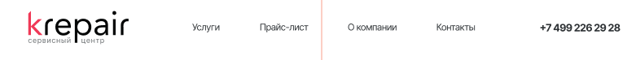
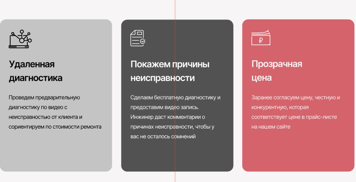

# lab_1

# Человек

## Человек__голова

### Человек__глаз--закрыт
### Человек__глаз--открыт
### Человек__нос--дышит

## Человек__тело
### Челове__легкие--дышат
### Челове__почки--фильтруют
### Челове__сердце--качает

## Человек__ноги
### Человек__мышцы--напрягются
### Человек__стопы--ходят
### Человек__кости--ломаются

header.header>.container>img+nav.nav>ul.nav__list>li.nav__item*5>a.nav__link 

# Форма ->  section.section.section--bg>.container>(ul.info>(li.info__item*2>p.info__title+p.info__text)+li.info__item>p.info__title+p.info__text*3)+form.form__info>p.form__title+label*5+input.form__item*5+button.form__button

# Карточка ->  .card>img.card__img+p.card__title+p.card__price

# Доп.блок -> 
