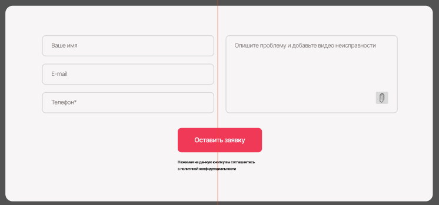
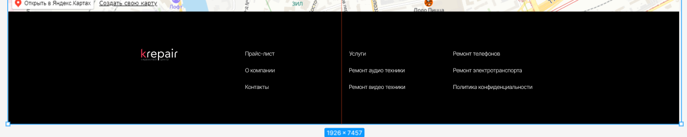

# lab_1

# Человек

## Человек__голова

### Человек__глаз--закрыт
### Человек__глаз--открыт
### Человек__нос--дышит

## Человек__тело
### Челове__легкие--дышат
### Челове__почки--фильтруют
### Челове__сердце--качает

## Человек__ноги
### Человек__мышцы--напрягются
### Человек__стопы--ходят
### Человек__кости--ломаются

# Header -> header.header>img.logo+a.logo__link>nav.nav+ul.nav__list+li.nav__item+a.nav__link*4>p>a.nav__link 

# Форма -> form>label>input.form__name+label>input.form__name+label>input.form__name>input.form_comments+img>button.form__button+p.form__text

# Карточка -> div.card>img.card__img+p.card__title+p.card__text

#``` Доп.блок -> section.footer>img.footer__logo+p.footer__text*3+p.footer_text*3+p.footer__text*3```
